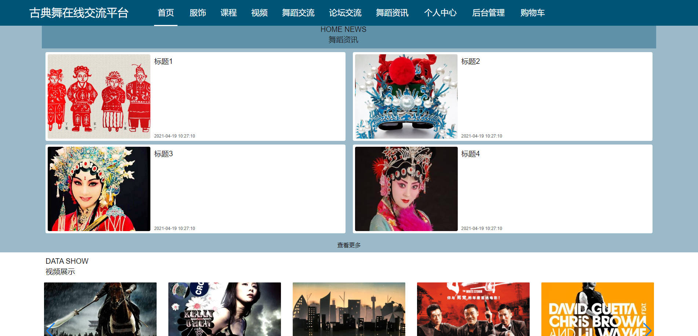

# 基于Springboot的古典舞在线交流平台

## Springboot-0046


## 技术栈

Springboot mybatisplus vue mysql maven


## 数据库表(22张)


## 功能介绍

```properties
用户在系统前台可查看系统信息，包括首页、服务、课程、视频、论坛交流、舞蹈资讯等，用户要想实现发帖、服饰购买等操作，必须登录系统，没有账号的用户可进行注册操作，注册登录后主要功能模块包括个人中心、我的订单、我的地址、服饰管理、课程管理、视频管理、论坛交流管理以及我的收藏管理。


管理员可登录系统后台对系统进行全面管理操作，管理员主要功能模块包括个人中心、会员用户管理、服饰管理、课程管理、视频管理、论坛交流管理、服务类型管理、视频分类管理、课程类型管理、系统管理以及订单管理。


```


## 图片

### 前台





### 后台


## 访问路径

### 前台

```properties
http://localhost:8080/springbootts2gs/front/pages/login/login.html

账号 会员用户1
密码 123456
```

### 后台

```properties
http://localhost:8080/springbootts2gs/admin/dist/index.html#/login

账号 abo
密码 abo
```


## 功能图


## 文档目录


## 打赏或交流


